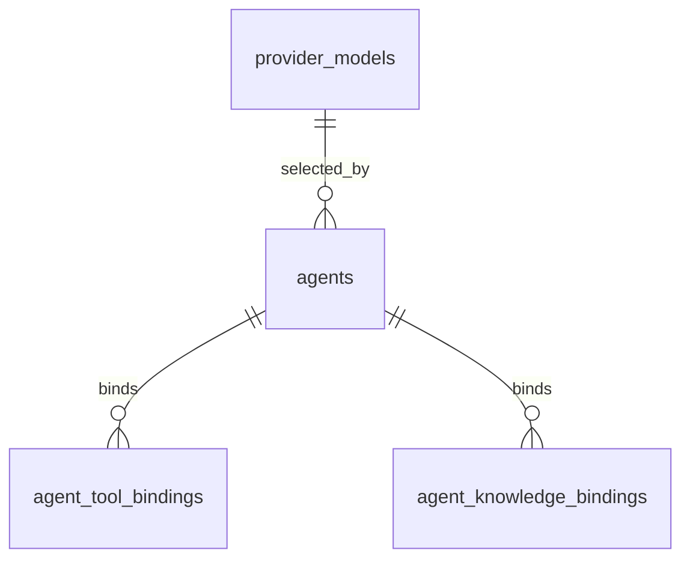

# Agent 配置数据库设计

## 1. 设计目标

Agent 配置模块的数据库设计目标：

- 支持 Agent 基础 CRUD 和软删除。
- 支持一个 Agent 绑定一个默认模型配置。
- 支持一个 Agent 绑定多个工具和多个知识库。
- 支持系统提示词、开场白、模型参数、运行参数等配置。
- 为后续 Workflow 编排预留扩展能力，但一期不实现 Workflow 表结构。

本设计采用方案 B：`agents` 主表 + 模型引用字段 + 工具/知识库绑定关系表。

## 2. Workflow 扩展边界

当前 Agent 是“可被对话模块运行的配置实体”，不是 Workflow 定义本身。

未来 Workflow 编排建议独立新增：

- `workflow_definitions`
- `workflow_versions`
- `workflow_nodes`
- `workflow_edges`
- `workflow_runs`

Agent 与 Workflow 的关系建议为：

- `agents.orchestration_mode = 'workflow'`
- 通过未来新增字段或独立关联表指向某个 workflow definition/version
- `conversation` 模块负责加载 Agent 后执行对应编排

因此当前 `agents` 表预留：

- `orchestration_mode`：区分 `agent`、`chatbot`、`workflow`
- `workflow_ref_json`：一期仅作为预留扩展槽，不作为强业务字段
- `runtime_config_json`：保存执行层通用参数，例如最大迭代次数、是否流式、上下文窗口策略

这样做的目的：

- 一期不把 Workflow 复杂度提前引入 Agent 配置。
- 二期新增 Workflow 表时，不需要推翻 Agent 主体数据结构。
- `agent` 模块继续只保存配置，真实编排仍在 `conversation`。

## 3. ER 图

说明：

- `provider_models` 已由 Provider 管理模块创建。
- `tools` 和 `knowledge_bases` 已由各自模块创建。Agent 绑定表仍只保存 ID，不加跨模块外键，以降低模块迁移耦合；存在性和状态校验由服务层承担。

## 4. 表设计

### 4.1 `agents`

表示一个可配置、可启用、可被 conversation 运行的 Agent。

关键字段：

- `id`
- `name`
- `description`
- `avatar_url`
- `status`
- `orchestration_mode`
- `provider_instance_id`
- `provider_model_id`
- `system_prompt`
- `opening_message`
- `model_config_json`
- `runtime_config_json`
- `workflow_ref_json`
- `tags_json`
- `metadata_json`
- `created_at`
- `updated_at`
- `deleted_at`
- `version`

字段说明：

- `name`：Agent 名称，面向管理员展示。
- `description`：Agent 用途描述。
- `avatar_url`：头像或图标地址，一期可为空。
- `status`：生命周期状态。
- `orchestration_mode`：编排模式，一期默认 `agent`。
- `provider_instance_id`：引用 Provider 实例 ID，用于快速定位供应商。
- `provider_model_id`：引用 Provider Model ID，表示默认模型。
- `system_prompt`：系统提示词。
- `opening_message`：对话开场白。
- `model_config_json`：模型参数，例如 `temperature`、`topP`、`maxTokens`。
- `runtime_config_json`：运行参数，例如 `stream`、`maxIterations`、`memoryWindow`。
- `workflow_ref_json`：Workflow 扩展预留，例如未来保存 workflow definition/version 引用。
- `tags_json`：标签列表。
- `metadata_json`：扩展信息。

约束与索引：

- `name <> ''`
- `status <> ''`
- `orchestration_mode <> ''`
- `version >= 1`
- `provider_model_id` 外键引用 `provider_models.id`
- `deleted_at` 普通索引
- `status` 普通索引
- `orchestration_mode` 普通索引
- `provider_model_id` 普通索引
- 活跃数据中 `name` 唯一：`deleted_at IS NULL` 时唯一

设计说明：

- `provider_instance_id` 暂不加外键，避免跨模块变更带来的额外迁移耦合；服务层负责校验存在性。
- `provider_model_id` 加外键，因为 `provider_models` 表已经是 Provider 管理模块的稳定可执行 artifact。
- 模型参数不拆成大量列，因为不同 Provider 参数差异较大，当前不需要按参数筛选。

### 4.2 `agent_tool_bindings`

表示 Agent 可调用的工具集合。

关键字段：

- `id`
- `agent_id`
- `tool_id`
- `binding_name`
- `is_enabled`
- `sort_order`
- `config_json`
- `metadata_json`
- `created_at`
- `updated_at`
- `deleted_at`
- `version`

字段说明：

- `agent_id`：所属 Agent。
- `tool_id`：工具 ID，一期只保存 ID。
- `binding_name`：绑定展示名，可覆盖工具默认名称。
- `is_enabled`：是否启用该工具绑定。
- `sort_order`：前端展示顺序。
- `config_json`：工具调用配置，例如参数默认值、隐藏参数、超时时间。
- `metadata_json`：扩展信息。

约束与索引：

- `agent_id` 外键引用 `agents.id`
- `tool_id > 0`
- `sort_order >= 0`
- `version >= 1`
- `agent_id` 普通索引
- `tool_id` 普通索引
- `deleted_at` 普通索引
- 活跃数据中 `(agent_id, tool_id)` 唯一

设计说明：

- 当前不加 `tools.id` 外键，因为工具模块表结构尚未迁移落地。
- 删除 Agent 时，服务层同步软删除绑定记录。

### 4.3 `agent_knowledge_bindings`

表示 Agent 可检索的知识库集合。

关键字段：

- `id`
- `agent_id`
- `knowledge_base_id`
- `is_enabled`
- `sort_order`
- `retrieval_config_json`
- `metadata_json`
- `created_at`
- `updated_at`
- `deleted_at`
- `version`

字段说明：

- `agent_id`：所属 Agent。
- `knowledge_base_id`：知识库 ID，一期只保存 ID。
- `is_enabled`：是否启用该知识库绑定。
- `sort_order`：前端展示顺序。
- `retrieval_config_json`：检索配置，例如 `topK`、`scoreThreshold`、`rerankEnabled`。
- `metadata_json`：扩展信息。

约束与索引：

- `agent_id` 外键引用 `agents.id`
- `knowledge_base_id > 0`
- `sort_order >= 0`
- `version >= 1`
- `agent_id` 普通索引
- `knowledge_base_id` 普通索引
- `deleted_at` 普通索引
- 活跃数据中 `(agent_id, knowledge_base_id)` 唯一

设计说明：

- 当前不加 `knowledge_bases.id` 外键，因为知识库模块表结构尚未迁移落地。
- 检索行为不在 `agent` 模块执行，后续由 `conversation` 读取配置后调用 `knowledge`。

## 5. 状态值与生命周期

### 5.1 Agent 状态

`agents.status` 建议值：

- `draft`：草稿，可编辑，不建议对外使用。
- `active`：启用，可被对话模块使用。
- `disabled`：停用，保留配置但不可运行。
- `archived`：归档，通常不展示在默认列表中。

生命周期规则：

- 创建默认 `draft`。
- 只有配置了有效模型后才允许切换到 `active`。
- `disabled` 可恢复到 `active`。
- 删除使用软删除，不物理删除。

### 5.2 编排模式

`agents.orchestration_mode` 建议值：

- `agent`：一期默认模式，表示普通 Agent。
- `chatbot`：纯聊天助手模式，可复用同一配置主体。
- `workflow`：未来 Workflow 编排模式。

生命周期规则：

- 一期创建默认 `agent`。
- 当 `orchestration_mode = 'workflow'` 时，未来必须校验 workflow 引用存在且可运行。
- 当前一期只预留字段，不执行 Workflow 校验。

## 6. 软删除策略

三张表全部继承公共审计字段并支持软删除：

- `deleted_at is null` 表示有效记录。
- 删除 Agent 时，`agent_tool_bindings` 和 `agent_knowledge_bindings` 同步软删除。
- 活跃唯一约束使用 PostgreSQL partial unique index，允许软删除后复用名称或绑定。

## 7. 迁移策略

新增 Alembic 迁移：

- `20260505_0005_create_agent_configuration_tables.py`

迁移内容：

- 创建 `agents`
- 创建 `agent_tool_bindings`
- 创建 `agent_knowledge_bindings`
- 创建普通索引和 partial unique index

回滚策略：

- 先删除绑定表索引和绑定表
- 再删除 `agents` 索引和主表

## 8. Seed 与回填

本期不需要默认 Seed。

如果后续需要演示数据，可以通过独立脚本创建：

- 一个草稿 Agent
- 一个绑定默认 Provider Model 的启用 Agent
- 若干工具/知识库绑定样例

## 9. 待确认问题

- `provider_model_id` 是否作为 Agent 启用的强必填字段：建议创建草稿时可为空，启用时必填。
- `workflow_ref_json` 是否保留在一期迁移中：建议保留，作为低成本扩展槽。
- 工具和知识库绑定是否需要当前就做强存在性校验：建议服务层校验，但不加数据库外键。
