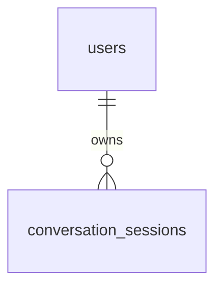

# 登录与鉴权数据库设计

## 1. 实体关系

登录模块复用用户管理已经维护的 `users` 表，不新增会话表或 token 表。

## 2. `users` 相关字段

- `username`：登录账号之一，未软删除用户内唯一。
- `email`：登录账号之一，未软删除用户内唯一。
- `password_hash`：PBKDF2 salted hash，禁止接口返回。
- `role`：`admin` 或 `member`，当前阶段仅用于展示和后续扩展，不限制功能。
- `is_active`：禁用用户不能登录，也不能继续访问需登录接口。
- `last_login_at`：登录成功时更新。
- `deleted_at`：软删除用户不能登录。

## 3. Seed 策略

本地开发复用 `root` 作为初始管理员账号：

- `username`: `root`
- `email`: `root@hify.local`
- `password`: `123456`
- `role`: `admin`
- `is_active`: `true`

数据库仍只保存哈希。生产环境不得依赖该默认密码，部署前必须通过运维脚本或用户管理接口重置。

## 4. 迁移策略

本次登录功能不新增表结构。依赖用户管理迁移提供：

- `last_login_at`
- 软删除感知唯一索引
- `role/is_active/password_hash` 约束
