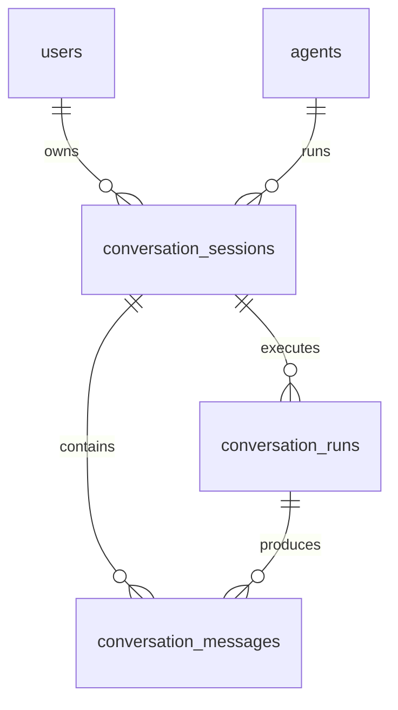

# 会话模块数据库设计

## 1. 设计目标

会话模块一期直接承载真实运行链路：用户选择 Agent 后发起
SSE 对话，`conversation` 加载 Agent 配置、调用 LLM、流式输出并保存
对话日志。

数据库设计目标：

- 支持会话列表、会话详情、消息历史和软删除。
- 支持一次用户输入触发一次可追踪的运行记录。
- 支持 SSE 流式过程中先落用户消息，再逐步汇总 assistant 消息。
- 保存运行时 Agent、Provider、Model 的关键快照，避免后续配置变更导致
  历史对话不可解释。
- 为后续工具调用、RAG 检索和 Workflow 运行保留结构化扩展位，但一期不
  提前实现复杂执行明细表。

## 2. ER 图

说明：

- `users` 表由 Auth 模块创建。
- `agents` 表由 Agent 配置模块创建。
- 会话属于某个用户，默认只能由所属用户查看、继续、归档或删除。
- 会话表对 `agents.id` 建外键，因为真实对话必须绑定一个已有 Agent。
- 消息和运行记录都属于会话；删除会话时服务层同步软删除消息和运行记录。
- Provider 与 Model 信息以快照 JSON 保存，不额外对 Provider 表建强外键。

## 3. 表设计

### 3.1 `conversation_sessions`

表示用户与一个 Agent 的一次持续会话。

关键字段：

- `id`
- `user_id`
- `agent_id`
- `title`
- `status`
- `channel`
- `agent_snapshot_json`
- `last_message_role`
- `last_message_preview`
- `last_message_at`
- `message_count`
- `metadata_json`
- `created_at`
- `updated_at`
- `deleted_at`
- `version`

字段说明：

- `user_id`：会话所属用户 ID，来自当前登录态，不由前端提交。
- `agent_id`：绑定的 Agent ID。
- `title`：会话标题，默认可由首条用户消息截断生成。
- `status`：会话生命周期。
- `channel`：入口渠道，一期默认为 `web`，后续可扩展 API 集成。
- `agent_snapshot_json`：创建会话时的 Agent 关键快照，包括 Agent 名称、
  编排模式、提示词摘要、模型引用、运行参数、工具/知识库绑定摘要。
- `last_message_role`：最后一条消息角色，用于列表快速展示。
- `last_message_preview`：最后一条消息摘要。
- `last_message_at`：最后消息时间，用于列表排序。
- `message_count`：活跃消息数量缓存。
- `metadata_json`：扩展信息。

约束与索引：

- `user_id` 外键引用 `users.id`
- `agent_id` 外键引用 `agents.id`
- `title <> ''`
- `status <> ''`
- `channel <> ''`
- `message_count >= 0`
- `version >= 1`
- `agent_id` 普通索引
- `user_id` 普通索引
- `(user_id, status)` 普通索引
- `status` 普通索引
- `last_message_at` 普通索引
- `deleted_at` 普通索引

### 3.2 `conversation_messages`

表示会话中的一条消息。用户消息、assistant 回复、系统消息、工具消息都放在
同一张表中，通过 `role` 区分。

关键字段：

- `id`
- `conversation_id`
- `run_id`
- `role`
- `status`
- `content`
- `content_format`
- `sequence`
- `token_count`
- `latency_ms`
- `model_snapshot_json`
- `tool_call_json`
- `error_json`
- `metadata_json`
- `created_at`
- `updated_at`
- `deleted_at`
- `version`

字段说明：

- `conversation_id`：所属会话。
- `run_id`：关联本轮运行；用户消息和 assistant 消息都可关联同一个 run。
- `role`：消息角色。
- `status`：消息生成状态。SSE 中 assistant 消息先为 `streaming`，完成后改为
  `completed`，异常时改为 `failed`。
- `content`：消息正文。一期只存纯文本。
- `content_format`：内容格式，一期默认为 `text`。
- `sequence`：会话内递增序号，用于稳定排序。
- `token_count`：该消息估算或供应商返回的 token 数，一期可为空。
- `latency_ms`：该消息生成耗时，一期主要用于 assistant 消息。
- `model_snapshot_json`：本消息使用的模型快照。
- `tool_call_json`：工具调用结果预留。
- `error_json`：失败时记录结构化错误。
- `metadata_json`：扩展信息。

约束与索引：

- `conversation_id` 外键引用 `conversation_sessions.id`
- `run_id` 外键引用 `conversation_runs.id`，允许为空
- `role <> ''`
- `status <> ''`
- `content_format <> ''`
- `sequence >= 1`
- `token_count >= 0`
- `latency_ms >= 0`
- `version >= 1`
- 活跃数据中 `(conversation_id, sequence)` 唯一
- `conversation_id` 普通索引
- `run_id` 普通索引
- `role` 普通索引
- `created_at` 普通索引
- `deleted_at` 普通索引

### 3.3 `conversation_runs`

表示一次用户发送消息后触发的执行过程。真实 LLM 调用、SSE 输出、错误状态和
耗时都归属于 run。

关键字段：

- `id`
- `conversation_id`
- `agent_id`
- `status`
- `trigger_message_id`
- `assistant_message_id`
- `provider_instance_id`
- `provider_model_id`
- `litellm_model`
- `started_at`
- `completed_at`
- `latency_ms`
- `input_token_count`
- `output_token_count`
- `total_token_count`
- `request_json`
- `response_json`
- `error_json`
- `metadata_json`
- `created_at`
- `updated_at`
- `deleted_at`
- `version`

字段说明：

- `conversation_id`：所属会话。
- `agent_id`：运行时绑定 Agent。冗余保存便于按 Agent 统计。
- `status`：运行生命周期。
- `trigger_message_id`：触发本次运行的用户消息。
- `assistant_message_id`：本次运行生成的 assistant 消息。
- `provider_instance_id`：运行时 Provider 实例 ID 快照。
- `provider_model_id`：运行时 Provider Model ID 快照。
- `litellm_model`：最终传给 LiteLLM 的模型标识。
- `started_at`、`completed_at`：运行起止时间。
- `latency_ms`：运行总耗时。
- `input_token_count`、`output_token_count`、`total_token_count`：token 统计。
- `request_json`：脱敏后的 LLM 请求摘要，不保存密钥。
- `response_json`：脱敏后的 LLM 响应摘要，不保存完整流式分片。
- `error_json`：异常码、异常消息、上游错误类型等结构化信息。
- `metadata_json`：扩展信息。

约束与索引：

- `conversation_id` 外键引用 `conversation_sessions.id`
- `agent_id` 外键引用 `agents.id`
- `trigger_message_id` 外键引用 `conversation_messages.id`，允许为空以避免建表
  时循环强依赖造成迁移复杂度
- `assistant_message_id` 外键引用 `conversation_messages.id`，允许为空
- `status <> ''`
- `latency_ms >= 0`
- `input_token_count >= 0`
- `output_token_count >= 0`
- `total_token_count >= 0`
- `version >= 1`
- `conversation_id` 普通索引
- `agent_id` 普通索引
- `status` 普通索引
- `started_at` 普通索引
- `deleted_at` 普通索引

## 4. 状态值与生命周期

### 4.1 会话状态

`conversation_sessions.status` 建议值：

- `active`：可继续对话。
- `archived`：归档，默认列表可隐藏。
- `deleted`：服务层软删除前的业务状态，可选使用。

删除策略：

- 删除会话使用软删除。
- 服务层同步软删除所属消息和运行记录。
- 默认列表只返回 `deleted_at IS NULL` 且非归档数据，归档筛选由 API 控制。

### 4.2 消息角色

`conversation_messages.role` 建议值：

- `user`
- `assistant`
- `system`
- `tool`

一期真实对话至少使用 `user` 与 `assistant`；`system` 主要来自 Agent 提示词
上下文，不一定作为可见消息落库；`tool` 为后续工具调用预留。

### 4.3 消息状态

`conversation_messages.status` 建议值：

- `pending`
- `streaming`
- `completed`
- `failed`
- `cancelled`

SSE 流程建议：

1. 事务内创建 user 消息、run 记录、assistant 空消息。
2. assistant 消息进入 `streaming`。
3. 每个 SSE chunk 直接发给前端，服务层在内存中累计文本。
4. 流结束后一次性更新 assistant `content`、`status = completed`、run 统计。
5. 上游异常时更新 assistant `status = failed`、run `status = failed` 并写入
   `error_json`。

这样避免每个 token 都写库，同时保证最终历史可恢复。

### 4.4 运行状态

`conversation_runs.status` 建议值：

- `queued`
- `running`
- `completed`
- `failed`
- `cancelled`

一期不实现独立队列，创建 run 后直接进入 `running`。保留 `queued` 是为了后续
后台任务或并发限流扩展。

## 5. 唯一约束、索引和外键

外键：

- `conversation_sessions.user_id -> users.id`
- `conversation_sessions.agent_id -> agents.id`
- `conversation_messages.conversation_id -> conversation_sessions.id`
- `conversation_messages.run_id -> conversation_runs.id`
- `conversation_runs.conversation_id -> conversation_sessions.id`
- `conversation_runs.agent_id -> agents.id`
- `conversation_runs.trigger_message_id -> conversation_messages.id`
- `conversation_runs.assistant_message_id -> conversation_messages.id`

唯一约束：

- 活跃消息中 `(conversation_id, sequence)` 唯一。

关键索引：

- 会话列表：`user_id`、`deleted_at`、`status`、`agent_id`、`last_message_at`
- 用户归档检索：`(user_id, status)`
- 消息读取：`conversation_id`、`sequence`、`created_at`
- 运行排查：`conversation_id`、`agent_id`、`status`、`started_at`

## 6. 迁移策略

新增 Alembic 迁移：

- `20260505_0006_create_conversation_tables.py`

迁移顺序：

1. 创建 `conversation_sessions`。
2. 创建 `conversation_runs`，暂不创建指向 messages 的外键。
3. 创建 `conversation_messages`。
4. 补充 runs 到 messages 的外键。
5. 创建索引和活跃唯一索引。

迁移不包含会话数据回填，因为当前 `conversation` 只有占位模型，没有历史数据。

## 7. Seed 和回填

一期需要 seed 一个临时 root 用户：

- `username`: `root`
- `email`: `root@hify.local`
- `password`: `123456`
- `role`: `admin`
- `is_active`: `true`

数据库只保存密码哈希，不保存明文密码。当前登录功能尚未开发时，会话默认关联
到该 root 用户。后续登录模块落地后，可以继续使用该用户作为本地管理员账号。

如果后续需要演示会话数据，应通过 API 创建临时 Agent 与会话，不直接在迁移中
写入业务会话数据。

## 8. 敏感信息规则

- 不在任何会话表保存 Provider 明文密钥。
- `request_json` 只保存脱敏后的提示词、参数和模型标识摘要。
- `response_json` 不保存完整供应商原始响应，只保存 finish reason、usage、
  provider request id 等安全字段。
- `error_json` 不保存上游返回中的密钥、Header 或完整请求体。
