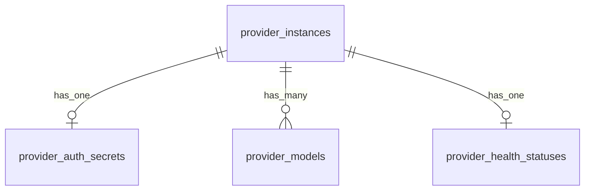

# Provider 管理数据库设计

## 1. 设计目标

数据库设计目标：

- 支持前端单页面管理
- 支持一个 Provider 实例下多个模型
- 支持密钥密文存储
- 支持后续扩展健康检查、模型能力和运行策略

## 2. ER 图

## 3. 表设计

### 3.1 `provider_instances`

表示一个供应商账号实例。

关键字段：

- `id`
- `name`
- `provider_type`
- `api_family`
- `base_url`
- `status`
- `is_default`
- `priority`
- `notes`
- `metadata_json`
- `created_at`
- `updated_at`
- `deleted_at`
- `version`

关键约束：

- `name` 唯一
- `name` 非空
- `priority >= 0`

设计说明：

- `provider_type` 表示厂商类别，例如 `openai`、`anthropic`
- `api_family` 表示调用协议类别，例如 `openai_responses`
- `is_default` 用于标识全局默认 Provider 实例

### 3.2 `provider_auth_secrets`

表示 Provider 实例的鉴权信息。

关键字段：

- `id`
- `provider_instance_id`
- `auth_type`
- `secret_ciphertext`
- `secret_masked`
- `secret_fingerprint`
- `encryption_key_version`
- `last_rotated_at`
- `expires_at`
- `metadata_json`
- `created_at`
- `updated_at`
- `deleted_at`
- `version`

关键约束：

- `provider_instance_id` 唯一
- `secret_ciphertext` 非空

设计说明：

- 与 `provider_instances` 是 1:1
- `metadata_json` 用于存储 headers、query 参数等非明文辅助信息
- `secret_fingerprint` 用于判断密钥是否变化，不可逆

### 3.3 `provider_models`

表示管理员手工维护的模型配置。

关键字段：

- `id`
- `provider_instance_id`
- `model_name`
- `display_name`
- `description`
- `status`
- `is_default`
- `sort_order`
- `supports_chat`
- `supports_stream`
- `supports_tools`
- `supports_structured_output`
- `supports_vision_input`
- `supports_audio_input`
- `supports_reasoning`
- `supports_embeddings`
- `context_window`
- `max_output_tokens`
- `max_input_tokens`
- `temperature_supported`
- `top_p_supported`
- `tags_json`
- `pricing_json`
- `metadata_json`
- `created_at`
- `updated_at`
- `deleted_at`
- `version`

关键约束：

- `(provider_instance_id, model_name)` 唯一
- `model_name` 非空
- `sort_order >= 0`

设计说明：

- 模型为手工维护，不做自动发现
- `is_default` 表示该实例下默认模型
- 能力字段采用显式布尔列，便于筛选和前端显示

### 3.4 `provider_health_statuses`

表示 Provider 实例当前健康快照。

关键字段：

- `id`
- `provider_instance_id`
- `health_state`
- `auth_state`
- `connectivity_state`
- `inference_state`
- `last_check_at`
- `last_success_at`
- `last_failure_at`
- `consecutive_failures`
- `latency_ms_p50`
- `latency_ms_p95`
- `last_error_code`
- `last_error_message`
- `last_error_at`
- `created_at`
- `updated_at`
- `deleted_at`
- `version`

关键约束：

- `provider_instance_id` 唯一

设计说明：

- 与 `provider_instances` 是 1:1
- 当前只表示实例级健康状态，不表示模型级健康

## 4. 软删除策略

四张核心表全部继承公共审计字段，支持软删除：

- `deleted_at is null` 表示有效记录
- 删除 Provider 时，子表记录同步软删除
- 更新模型列表时，当前实现采用旧模型软删除、新模型重建

## 5. 后续扩展方向

后续可以扩展但当前未落库的表：

- `provider_health_check_logs`
- `provider_usage_logs`
- `provider_routing_policies`
- `provider_model_capability_snapshots`

当前表结构不会阻碍这些扩展。
