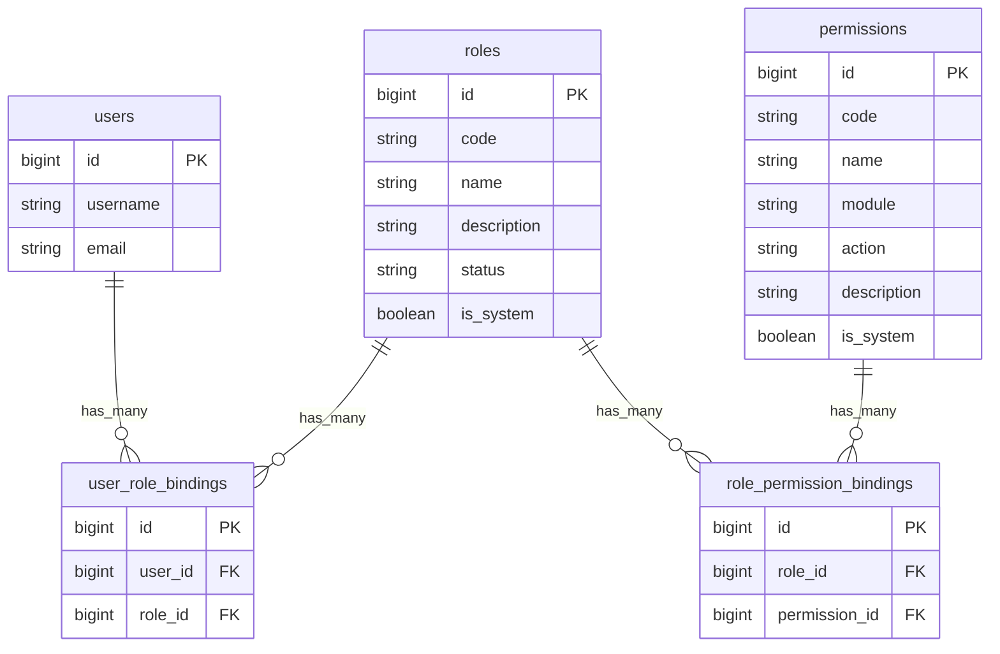

# RBAC 权限管理数据库设计

## 1. 设计目标

RBAC 模块用于替代当前 `users.role = admin/member` 的粗粒度权限字段，让 Hify
可以通过角色和权限绑定控制后台配置、用户管理、对话使用和后续发布集成能力。

本期数据库目标：

- 新增角色、权限、用户角色绑定、角色权限绑定四类持久化实体。
- 内置 `admin` 和 `member` 两个系统角色。
- 内置稳定权限点，由系统 seed 管理，不允许管理员随意创建权限 code。
- 将现有 `users.role` 强制迁移为 `user_role_bindings`。
- 迁移完成后删除 `users.role` 字段和相关约束，后端权限判断统一走 RBAC。
- 保留软删除、版本号、创建更新时间，与现有模块一致。

## 2. ER 图



## 3. 表设计

### 3.1 `roles`

表示可分配给用户的角色。

| 字段 | 类型 | 说明 |
|---|---|---|
| `id` | `bigint` | 主键 |
| `code` | `varchar(64)` | 稳定角色编码，如 `admin`、`member` |
| `name` | `varchar(128)` | 展示名称 |
| `description` | `text` | 角色说明 |
| `status` | `varchar(32)` | `enabled`、`disabled` |
| `is_system` | `boolean` | 是否系统内置角色 |
| audit columns | - | `created_at/updated_at/deleted_at/version` |

生命周期规则：

- `admin`、`member` 为系统角色，不能删除，`code` 不能修改。
- `disabled` 角色不能继续给新用户分配，已绑定用户的权限解析也不计入该角色。
- 非系统角色可以软删除，软删除时同步软删除其用户绑定和权限绑定。

### 3.2 `permissions`

表示系统内置权限点。

| 字段 | 类型 | 说明 |
|---|---|---|
| `id` | `bigint` | 主键 |
| `code` | `varchar(128)` | 稳定权限编码，如 `provider.manage` |
| `name` | `varchar(128)` | 展示名称 |
| `module` | `varchar(64)` | 所属模块 |
| `action` | `varchar(64)` | 动作，如 `read`、`manage`、`use` |
| `description` | `text` | 权限说明 |
| `is_system` | `boolean` | 是否系统内置权限 |
| audit columns | - | `created_at/updated_at/deleted_at/version` |

生命周期规则：

- 本期权限点只由 seed 创建和更新。
- 管理员不能从页面新增或删除权限点，只能给角色授权。
- 权限 `code` 是后端依赖和前端菜单守卫的契约，创建后不能随意改名。

### 3.3 `user_role_bindings`

表示用户与角色的多对多关系。

| 字段 | 类型 | 说明 |
|---|---|---|
| `id` | `bigint` | 主键 |
| `user_id` | `bigint` | 用户 ID |
| `role_id` | `bigint` | 角色 ID |
| audit columns | - | `created_at/updated_at/deleted_at/version` |

生命周期规则：

- 同一用户不能重复绑定同一活跃角色。
- 用户软删除后不强制删除绑定，权限解析时只读取未删除且启用用户。
- 禁止移除最后一个拥有 `rbac.manage` 权限的启用用户，避免系统自锁。

### 3.4 `role_permission_bindings`

表示角色与权限的多对多关系。

| 字段 | 类型 | 说明 |
|---|---|---|
| `id` | `bigint` | 主键 |
| `role_id` | `bigint` | 角色 ID |
| `permission_id` | `bigint` | 权限 ID |
| audit columns | - | `created_at/updated_at/deleted_at/version` |

生命周期规则：

- 同一角色不能重复绑定同一活跃权限。
- 系统角色可以调整权限绑定，但必须保证至少一个启用用户拥有 `rbac.manage`。
- 权限删除或禁用不在一期开放，因此绑定只需要处理角色侧变更。

## 4. 内置角色和权限

### 4.1 内置角色

| code | name | 初始权限 |
|---|---|---|
| `admin` | 管理员 | 全部内置权限 |
| `member` | 普通用户 | 对话使用和本人会话能力 |

### 4.2 内置权限点

一期权限点按模块和动作控制：

| code | module | action | 说明 |
|---|---|---|---|
| `provider.read` | provider | read | 查看模型提供商 |
| `provider.manage` | provider | manage | 管理模型提供商 |
| `agent.read` | agent | read | 查看 Agent 配置 |
| `agent.manage` | agent | manage | 管理 Agent 配置 |
| `tool.read` | tool | read | 查看工具 |
| `tool.manage` | tool | manage | 管理工具 |
| `knowledge.read` | knowledge | read | 查看知识库 |
| `knowledge.manage` | knowledge | manage | 管理知识库 |
| `conversation.use` | conversation | use | 使用 Web 对话 |
| `conversation.read` | conversation | read | 查看本人会话和消息 |
| `conversation.manage` | conversation | manage | 管理会话日志 |
| `user.read` | user | read | 查看用户 |
| `user.manage` | user | manage | 管理用户 |
| `rbac.read` | rbac | read | 查看角色和权限 |
| `rbac.manage` | rbac | manage | 管理角色、授权和用户角色 |

默认授权：

- `admin`：全部权限。
- `member`：`conversation.use`、`conversation.read`。

说明：

- `read` 权限通常允许列表、详情和选项接口。
- `manage` 权限通常允许新增、编辑、删除、启用、禁用、测试等写操作。
- 后续发布模块可以新增 `publishing.read`、`publishing.manage`、`publishing.invoke`。

## 5. 约束和索引

### 5.1 唯一约束

- `roles.code`：活跃记录唯一，`ux_roles_code_active`。
- `permissions.code`：活跃记录唯一，`ux_permissions_code_active`。
- `user_role_bindings(user_id, role_id)`：活跃记录唯一。
- `role_permission_bindings(role_id, permission_id)`：活跃记录唯一。

### 5.2 外键

- `user_role_bindings.user_id -> users.id`
- `user_role_bindings.role_id -> roles.id`
- `role_permission_bindings.role_id -> roles.id`
- `role_permission_bindings.permission_id -> permissions.id`

外键均不使用级联删除，删除行为由 service 软删除控制。

### 5.3 普通索引

- `roles.status`
- `roles.is_system`
- `permissions.module`
- `permissions.action`
- `user_role_bindings.user_id`
- `user_role_bindings.role_id`
- `role_permission_bindings.role_id`
- `role_permission_bindings.permission_id`

## 6. 迁移策略

新增 Alembic 迁移：

```text
backend/alembic/versions/20260609_0011_compat_rbac_draft.py
backend/alembic/versions/20260630_0011_create_rbac_tables.py
backend/alembic/versions/20260630_0012_normalize_builtin_rbac_seed.py
```

迁移步骤：

1. 用 `20260609_0011` 兼容本地曾运行过的 RBAC 草稿迁移。
2. 创建 `roles`、`permissions`、`user_role_bindings`、`role_permission_bindings`。
3. Seed `admin`、`member` 两个系统角色。
4. Seed 一期内置权限点。
5. 给 `admin` 角色绑定全部权限。
6. 给 `member` 角色绑定 `conversation.use` 和 `conversation.read`。
7. 将现有 `users.role = 'admin'` 的用户绑定到 `admin` 角色。
8. 将其他未删除用户绑定到 `member` 角色。
9. 删除 `users.role` 相关索引、检查约束和字段。
10. 归一化内置 RBAC seed，确保 `admin`、`member` 是系统角色。

风险说明：

- 本迁移删除 `users.role`，因此必须和后端 `auth/user/rbac` 代码改造同一批交付。
- 如果只运行迁移而不更新代码，当前依赖 `User.role` 的登录和用户管理逻辑会失效。
- 迁移前必须确认至少存在一个未删除、启用的管理员用户；否则需要 seed `root`
  用户或人工指定管理员。

## 7. Seed 和回填

### 7.1 角色 seed

- `admin`：系统角色、启用。
- `member`：系统角色、启用。

### 7.2 权限 seed

权限 seed 使用稳定 `code` 作为幂等键。后续新增权限时，只能追加，不复用旧 code。

### 7.3 用户角色回填

回填规则：

- 迁移前 `users.role = 'admin'` -> 绑定 `admin`。
- 迁移前其他角色值或空值 -> 绑定 `member`。
- 已软删除用户也可回填绑定，但权限解析只读取未删除且启用用户。

## 8. Downgrade 策略

Downgrade 仅用于开发环境回退：

1. 恢复 `users.role` 字段，默认 `member`。
2. 根据 `user_role_bindings` 中是否绑定 `admin` 角色回填 `users.role`。
3. 恢复 `users.role` 检查约束和索引。
4. 删除 RBAC 绑定表和主表。

生产环境不建议依赖 downgrade 回退权限模型，应通过新迁移修正。

## 9. 后续与代码实现的衔接

Gate 3 API 合约需要明确：

- `/auth/me` 返回 `roles` 和 `permissions`，不再返回单一 `role` 作为权限依据。
- 用户管理接口不再提交 `role` 字段，角色分配走 RBAC 用户授权接口。
- 后端新增 `require_permission("permission.code")` 依赖。
- 前端菜单和路由根据当前用户 `permissions` 控制可见性和访问。

Gate 4 实现时需要同步移除或替换：

- `app.auth.model.User.role`
- `app.auth.deps.require_admin_user`
- `app.user.schema` 中的单角色字段
- 前端 `UserRole` 类型和用户管理表单中的单角色选择
