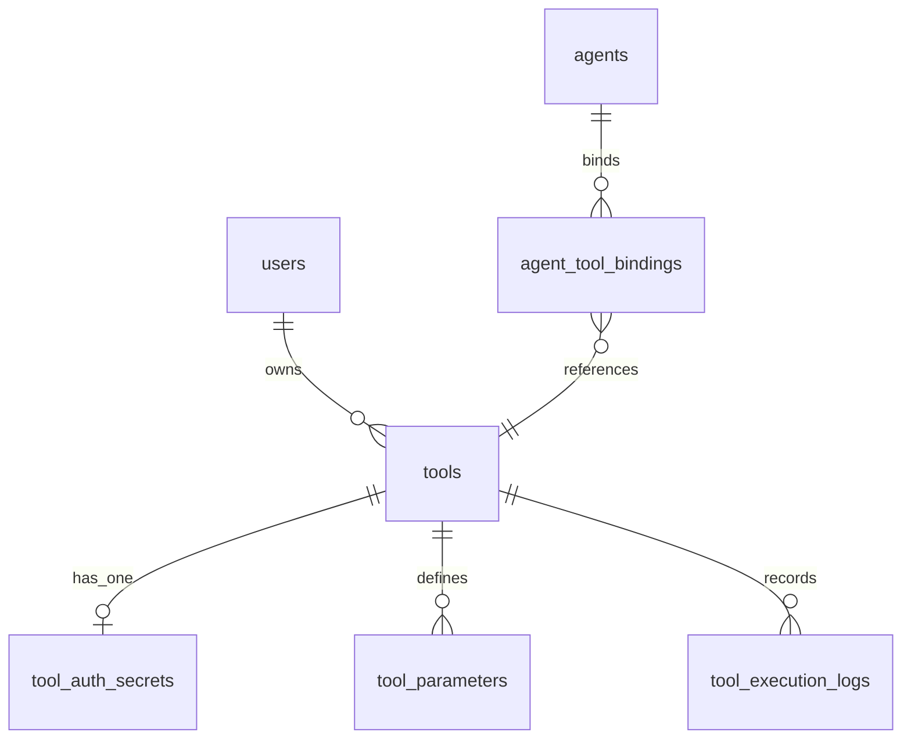

# 工具集成数据库设计

## 1. 设计目标

工具模块一期采用“手工 HTTP 工具 + 简版 OpenAPI 单 operation 导入”方案。

数据库设计目标：

- 支持管理员维护可被 Agent 绑定的 HTTP 工具。
- 支持从一个 OpenAPI operation 生成一个工具定义。
- 支持工具参数 schema，供前端测试表单和后续 LLM 工具调用使用。
- 支持鉴权信息密文存储，接口只返回脱敏值。
- 支持工具测试执行和后续会话执行的日志追踪。
- 为 `conversation` 后续编排调用工具预留稳定结构，但不把运行编排放入 `tool` 模块。

## 2. 实体关系概览



说明：

- `tools` 是工具主体，描述一个可执行 HTTP operation。
- `tool_auth_secrets` 保存工具鉴权密文，与工具一对一。
- `tool_parameters` 保存可由用户或 LLM 提供的入参定义。
- `tool_execution_logs` 保存测试执行和会话执行摘要。
- `agent_tool_bindings` 已由 Agent 配置模块创建，本模块落地后补充外键设计。

## 3. 表设计

### 3.1 `tools`

工具主体。一个工具表示一个可执行的 HTTP operation，而不是一个完整 OpenAPI 文档。

| 字段 | 类型 | 说明 |
|---|---|---|
| `id` | `bigint` | 主键 |
| `owner_user_id` | `bigint` | 创建人，关联 `users.id` |
| `name` | `varchar(128)` | 工具名称 |
| `description` | `text` | 工具说明，供管理员和后续 LLM 选择工具时理解用途 |
| `status` | `varchar(32)` | `draft`、`enabled`、`disabled`、`archived` |
| `tool_type` | `varchar(32)` | 一期固定为 `http` |
| `source_type` | `varchar(32)` | `manual`、`openapi` |
| `http_method` | `varchar(16)` | `GET`、`POST`、`PUT`、`PATCH`、`DELETE` |
| `url` | `varchar(2048)` | 完整 URL 或带参数占位符的 URL |
| `timeout_seconds` | `integer` | 执行超时时间 |
| `headers_template_json` | `json` | 非密钥请求头模板 |
| `query_template_json` | `json` | 查询参数模板 |
| `body_template_json` | `json` | JSON body 模板 |
| `content_type` | `varchar(128)` | 请求体类型，一期默认 `application/json` |
| `openapi_source_json` | `json` | OpenAPI 导入来源摘要 |
| `last_test_status` | `varchar(32)` | 最近一次测试状态 |
| `last_test_at` | `timestamptz` | 最近一次测试时间 |
| `last_test_latency_ms` | `integer` | 最近一次测试耗时 |
| `last_error_message` | `text` | 最近一次测试错误摘要 |
| `metadata_json` | `json` | 扩展信息 |
| audit columns | - | `id/created_at/updated_at/deleted_at/version` |

约束：

- `owner_user_id` 外键引用 `users.id`。
- `name <> ''`。
- `status <> ''`。
- `tool_type = 'http'`。
- `source_type in ('manual', 'openapi')`。
- `http_method in ('GET', 'POST', 'PUT', 'PATCH', 'DELETE')`。
- `url <> ''`。
- `timeout_seconds > 0`。
- `timeout_seconds <= 60`。
- `last_test_latency_ms >= 0`。
- `version >= 1`。

索引：

- `ix_tools_owner_user_id`。
- `ix_tools_status`。
- `ix_tools_tool_type`。
- `ix_tools_source_type`。
- `ix_tools_deleted_at`。
- `ix_tools_updated_at`。
- `ux_tools_owner_user_id_name_active`：
  `(owner_user_id, name)`，仅 `deleted_at IS NULL` 唯一。

设计说明：

- `url` 只允许 `http` / `https` 协议，服务层校验，数据库不承担 URL 解析。
- 请求模板不保存密钥；密钥统一进入 `tool_auth_secrets`。
- `last_test_*` 是列表页冗余字段，真实明细仍以 `tool_execution_logs` 为准。
- `openapi_source_json` 只保存来源摘要，例如 operationId、path、method、server URL，不保存完整大文档。

### 3.2 `tool_auth_secrets`

工具鉴权信息。

| 字段 | 类型 | 说明 |
|---|---|---|
| `id` | `bigint` | 主键 |
| `tool_id` | `bigint` | 关联 `tools.id` |
| `auth_type` | `varchar(32)` | `none`、`bearer`、`api_key_header`、`api_key_query` |
| `secret_ciphertext` | `text` | 加密后的 secret payload |
| `secret_masked` | `varchar(255)` | 脱敏展示值 |
| `secret_fingerprint` | `varchar(128)` | 不可逆指纹，用于判断密钥是否变化 |
| `encryption_key_version` | `varchar(32)` | 加密密钥版本 |
| `last_rotated_at` | `timestamptz` | 最近轮换时间 |
| `metadata_json` | `json` | Header 名、Query 名等非密文配置 |
| audit columns | - | `id/created_at/updated_at/deleted_at/version` |

约束：

- `tool_id` 外键引用 `tools.id`。
- 活跃数据中 `tool_id` 唯一。
- `auth_type <> ''`。
- `auth_type in ('none', 'bearer', 'api_key_header', 'api_key_query')`。
- 当 `auth_type != 'none'` 时，`secret_ciphertext` 非空。
- `version >= 1`。

索引：

- `ix_tool_auth_secrets_tool_id`。
- `ix_tool_auth_secrets_deleted_at`。
- `ux_tool_auth_secrets_tool_id_active`：
  `tool_id`，仅 `deleted_at IS NULL` 唯一。

Secret payload 建议结构：

```json
{
  "secretValue": "真实密钥",
  "headerName": "Authorization",
  "queryName": null
}
```

设计说明：

- `none` 类型允许无密钥，此时仍可创建一条 auth 记录用于表达鉴权策略。
- `metadata_json` 可保存 `headerName`、`queryName` 等非密文配置；如果这些字段也被认为敏感，可一并放入密文 payload。
- 接口永不返回 `secret_ciphertext` 和真实 `secretValue`。

### 3.3 `tool_parameters`

工具参数定义。参数用于生成测试执行表单，也为后续 LLM tool schema 提供来源。

| 字段 | 类型 | 说明 |
|---|---|---|
| `id` | `bigint` | 主键 |
| `tool_id` | `bigint` | 关联 `tools.id` |
| `name` | `varchar(128)` | 参数名 |
| `label` | `varchar(128)` | 展示名 |
| `description` | `text` | 参数说明 |
| `param_location` | `varchar(32)` | `path`、`query`、`header`、`body` |
| `schema_type` | `varchar(32)` | `string`、`number`、`integer`、`boolean`、`object`、`array` |
| `is_required` | `boolean` | 是否必填 |
| `default_value_json` | `json` | 默认值 |
| `enum_values_json` | `json` | 可选值列表 |
| `schema_json` | `json` | 原始 JSON Schema 子集 |
| `sort_order` | `integer` | 展示顺序 |
| `metadata_json` | `json` | 扩展信息 |
| audit columns | - | `id/created_at/updated_at/deleted_at/version` |

约束：

- `tool_id` 外键引用 `tools.id`。
- `name <> ''`。
- `param_location in ('path', 'query', 'header', 'body')`。
- `schema_type in ('string', 'number', 'integer', 'boolean', 'object', 'array')`。
- `sort_order >= 0`。
- `version >= 1`。
- 活跃数据中 `(tool_id, name, param_location)` 唯一。

索引：

- `ix_tool_parameters_tool_id`。
- `ix_tool_parameters_param_location`。
- `ix_tool_parameters_deleted_at`。
- `ux_tool_parameters_tool_id_name_location_active`：
  `(tool_id, name, param_location)`，仅 `deleted_at IS NULL` 唯一。

设计说明：

- 一期只要求 schema 子集可表达常见参数；复杂嵌套对象允许存入 `schema_json`，前端可以先以 JSON 输入展示。
- `header` 参数不用于保存密钥，密钥仍走 `tool_auth_secrets`。

### 3.4 `tool_execution_logs`

工具执行日志。用于后台测试执行，也为后续 Agent 会话工具调用排查预留。

| 字段 | 类型 | 说明 |
|---|---|---|
| `id` | `bigint` | 主键 |
| `tool_id` | `bigint` | 关联 `tools.id` |
| `executor_user_id` | `bigint` | 发起测试或执行的用户，可空 |
| `conversation_id` | `bigint` | 会话 ID，可空 |
| `run_id` | `bigint` | 会话 run ID，可空 |
| `source` | `varchar(32)` | `test`、`conversation` |
| `status` | `varchar(32)` | `success`、`failed`、`timeout` |
| `request_method` | `varchar(16)` | 实际请求方法 |
| `request_url` | `varchar(2048)` | 脱敏后的实际请求 URL |
| `request_headers_json` | `json` | 脱敏后的请求头摘要 |
| `request_body_preview` | `text` | 请求体摘要，限制长度 |
| `response_status_code` | `integer` | 上游 HTTP 状态码 |
| `response_headers_json` | `json` | 响应头摘要 |
| `response_body_preview` | `text` | 响应体摘要，限制长度 |
| `latency_ms` | `integer` | 执行耗时 |
| `error_code` | `varchar(64)` | 归一化错误码 |
| `error_message` | `text` | 错误摘要 |
| `metadata_json` | `json` | 扩展信息 |
| audit columns | - | `id/created_at/updated_at/deleted_at/version` |

约束：

- `tool_id` 外键引用 `tools.id`。
- `executor_user_id` 外键引用 `users.id`，可空。
- `source in ('test', 'conversation')`。
- `status in ('success', 'failed', 'timeout')`。
- `request_method <> ''`。
- `request_url <> ''`。
- `response_status_code >= 100` 且 `response_status_code <= 599`，可空。
- `latency_ms >= 0`。
- `version >= 1`。

索引：

- `ix_tool_execution_logs_tool_id`。
- `ix_tool_execution_logs_executor_user_id`。
- `ix_tool_execution_logs_source`。
- `ix_tool_execution_logs_status`。
- `ix_tool_execution_logs_created_at`。
- `ix_tool_execution_logs_conversation_id`。
- `ix_tool_execution_logs_run_id`。

设计说明：

- 日志只保存脱敏摘要，不保存真实密钥。
- `request_body_preview` 和 `response_body_preview` 应由服务层截断，避免大响应撑爆数据库。
- 一期测试执行写日志；后续 conversation 工具调用复用同一张表。

## 4. Agent 绑定表补充

当前 `agent_tool_bindings.tool_id` 只有正数校验，没有外键。

本模块建议补充：

- 外键：`agent_tool_bindings.tool_id -> tools.id`。
- 服务层校验：只有 `tools.status = 'enabled'` 且 `deleted_at IS NULL` 的工具可被新增绑定或启用。
- 前端不再要求用户手填 `toolId`，改为调用工具选项接口选择。

`agent_tool_bindings.config_json` 建议继续保留，用于每个 Agent 对工具的覆盖配置：

```json
{
  "enabledByDefault": true,
  "defaultParams": {},
  "timeoutSeconds": 15
}
```

## 5. 状态值与生命周期

### 5.1 工具状态

`tools.status` 建议值：

- `draft`：草稿，可编辑，不允许被新绑定启用。
- `enabled`：启用，可被 Agent 绑定和测试执行。
- `disabled`：停用，保留配置，不允许被 Agent 运行。
- `archived`：归档，默认列表不展示，不允许执行。

生命周期规则：

- 创建默认 `draft`，也允许在配置完整时直接创建为 `enabled`。
- `enabled` 前必须具备合法 URL、HTTP 方法、超时、参数定义和鉴权配置。
- `disabled` 可恢复到 `enabled`。
- 删除使用软删除，不物理删除。
- 删除工具前，如果已有活跃 Agent 绑定，服务层应阻止删除或先要求用户解绑；一期建议阻止删除并返回明确错误。

### 5.2 执行日志状态

`tool_execution_logs.status` 建议值：

- `success`：请求完成且上游返回 2xx。
- `failed`：请求完成但上游返回非 2xx，或请求构造失败。
- `timeout`：执行超时。

说明：

- 上游 4xx/5xx 代表工具链路跑通但业务失败，日志保存 `response_status_code` 和响应摘要。
- Hify 自身请求构造失败不应发出外部 HTTP 请求，记录为 `failed`。

## 6. 安全与数据边界

数据库层只保存结构，安全策略主要由服务层执行：

- 只允许 `http` / `https` URL。
- 默认禁止访问明显危险地址段，如 localhost、link-local、metadata service 地址；如本地开发确需调用内网服务，应通过配置显式放开。
- 请求头、Query、Body 中的敏感字段必须脱敏后写入日志。
- Secret 只进入 `tool_auth_secrets.secret_ciphertext`。
- 响应体和请求体日志必须截断，一期建议最多保存前 8KB。

## 7. 软删除策略

四张核心表全部继承公共审计字段并支持软删除：

- `deleted_at is null` 表示有效记录。
- 删除工具时，`tool_auth_secrets` 和 `tool_parameters` 同步软删除。
- `tool_execution_logs` 默认保留，不随工具删除同步删除，便于排查历史执行。
- 活跃唯一约束使用 PostgreSQL partial unique index，允许软删除后复用名称或参数。

## 8. 迁移策略

新增 Alembic 迁移：

- `20260523_0010_create_tool_tables.py`

迁移内容：

1. 扩展占位 `tools` 表为真实字段；如果当前环境尚无 `tools` 表，则创建完整表。
2. 创建 `tool_auth_secrets`。
3. 创建 `tool_parameters`。
4. 创建 `tool_execution_logs`。
5. 为 `agent_tool_bindings.tool_id` 补充到 `tools.id` 的外键。
6. 创建普通索引和 partial unique index。

回滚策略：

1. 先删除 `agent_tool_bindings.tool_id` 外键。
2. 删除 `tool_execution_logs`、`tool_parameters`、`tool_auth_secrets`。
3. 删除 `tools` 新增索引和表。

迁移注意事项：

- 当前 `Tool` ORM 是占位类，已有 `tools` 表是否存在取决于历史迁移和本地 `Base.metadata.create_all` 测试环境；迁移实现前需要检查 Alembic 当前 head 中是否已经创建过 `tools`。
- 如果已有测试数据中的 `agent_tool_bindings.tool_id` 没有对应工具，补外键前需要清理或迁移。

## 9. Seed 与回填

一期不需要默认 seed。

如需演示数据，可通过独立脚本创建：

- 一个无鉴权 GET 工具，例如天气查询 mock API。
- 一个 Bearer Token POST 工具，用于验证密钥脱敏和测试执行。

现有回填：

- `agent_tool_bindings` 可能存在 E2E 测试中的工具 ID 绑定。迁移落地前应检查是否需要插入对应工具或删除测试绑定。

## 10. 待确认问题

- 删除已绑定工具时，一期是否采用“阻止删除并提示解绑”。建议采用阻止删除，避免 Agent 配置悄悄失效。
- OpenAPI 导入接口是直接创建工具，还是先返回草稿供前端确认。建议先返回草稿预览，再由创建接口落库。
- 是否允许普通用户创建工具。建议一期沿用当前登录态，不做角色限制；后续 RBAC 再细分。
