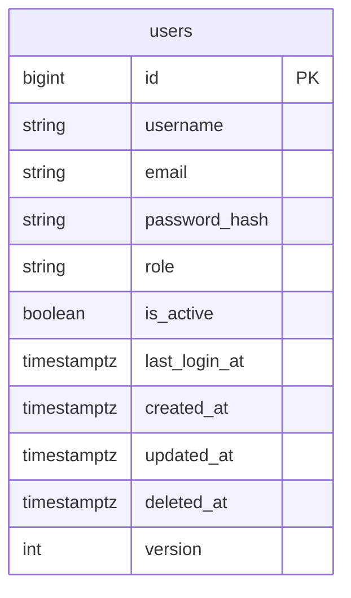
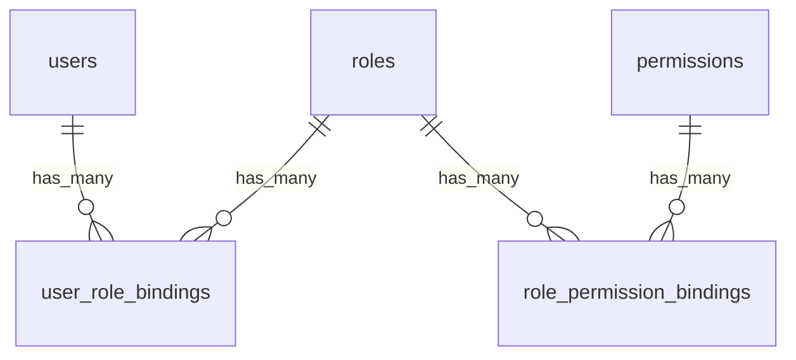

# 用户管理数据库设计

## 1. 设计目标

数据库设计目标：

- 复用现有 `users` 表承载账号主数据
- 支持用户 CRUD、启用禁用、软删除和密码重置
- 保留历史会话和其他业务数据的用户归属
- 一期支持 `admin` / `member` 两类角色
- 为后续 RBAC 角色和权限管理预留可演进路径

## 2. ER 图

一期落库范围：

后续 RBAC 扩展方向：

## 3. 表设计

### 3.1 `users`

表示 Hify 内部账号。

现有字段：

- `id`
- `username`
- `email`
- `password_hash`
- `role`
- `is_active`
- `created_at`
- `updated_at`
- `deleted_at`
- `version`

新增字段：

- `last_login_at`

字段说明：

| 字段 | 类型 | 说明 |
|---|---|---|
| `id` | `bigint` | 主键 |
| `username` | `varchar(64)` | 登录名和列表展示名，一期不单独拆昵称 |
| `email` | `varchar(255)` | 邮箱，后续可用于通知和找回密码 |
| `password_hash` | `varchar(255)` | 密码哈希，禁止接口返回 |
| `role` | `varchar(32)` | 一期角色标识，当前为 `admin` 或 `member` |
| `is_active` | `boolean` | 是否启用 |
| `last_login_at` | `timestamptz` | 最近一次登录时间，允许为空 |
| `created_at` | `timestamptz` | 创建时间 |
| `updated_at` | `timestamptz` | 更新时间 |
| `deleted_at` | `timestamptz` | 软删除时间 |
| `version` | `int` | 乐观锁版本字段 |

## 4. 状态、枚举和生命周期

### 4.1 角色值

一期允许：

- `admin`：管理员，可管理平台配置和用户
- `member`：普通用户，可使用对话等普通能力

数据库层建议增加 `role in ('admin', 'member')` 检查约束，保证一期数据质量。

后续 RBAC 扩展时：

- 可新增 `roles`、`permissions`、`user_role_bindings`、`role_permission_bindings`
- `users.role` 作为兼容字段保留一段时间
- 迁移脚本把现有 `users.role` 映射到内置角色记录和用户角色绑定
- API 响应可先同时返回 `role` 和 `roles`，前端完成迁移后再弱化单角色字段

### 4.2 启用状态

- `is_active = true`：用户可登录，可访问受保护接口
- `is_active = false`：用户被禁用，不允许登录；认证依赖应拒绝其访问

禁用不是删除，禁用用户仍然保留在列表中，默认可通过状态筛选查看。

### 4.3 删除状态

- `deleted_at is null`：有效用户
- `deleted_at is not null`：已软删除用户

软删除用户默认不出现在管理列表中，不允许登录，不参与用户名和邮箱唯一性校验。

### 4.4 关键生命周期规则

- 创建用户时必须写入 `password_hash`，不能存明文密码。
- 禁用用户不清空密码，重新启用后仍可用原密码登录，除非管理员重置。
- 软删除用户不清空 `password_hash`，但认证查询必须只查未删除用户。
- 禁止禁用或删除最后一个未删除、已启用的管理员。
- 禁止删除当前登录管理员自身，避免误操作导致当前管理会话悬空。

## 5. 约束与索引

### 5.1 唯一约束

现有迁移中 `users.username` 和 `users.email` 是全表唯一约束。为了支持软删除后复用用户名或邮箱，应改为只约束未删除记录的部分唯一索引：

- `ux_users_username_active`：`username` unique where `deleted_at is null`
- `ux_users_email_active`：`email` unique where `deleted_at is null`

迁移时需要先删除现有唯一约束：

- `uq_users_username`
- `uq_users_email`

### 5.2 普通索引

建议索引：

- `ix_users_email`：按邮箱查询
- `ix_users_deleted_at`：软删除过滤
- `ix_users_role`：角色筛选
- `ix_users_is_active`：状态筛选
- `ix_users_last_login_at`：按最近登录排序

### 5.3 检查约束

建议检查约束：

- `username <> ''`
- `email <> ''`
- `password_hash <> ''`
- `role <> ''`
- `role in ('admin', 'member')`
- `version >= 1`

## 6. 外键与历史归属

一期不新增从业务表到 `users` 的外键迁移，避免影响现有模块节奏。已有或后续业务表可以继续保存 `user_id`。

历史归属规则：

- 会话、Agent、知识库、工具等业务记录保留原始 `user_id`
- 用户软删除后，历史记录仍显示“已删除用户”或保留脱敏用户名
- 用户管理删除动作不级联删除业务数据

后续如果为业务表补外键，建议使用：

- `ON DELETE RESTRICT` 或默认无级联
- 业务删除仍通过软删除处理

## 7. 迁移策略

建议新增 Alembic 迁移：

1. 为 `users` 增加 `last_login_at` nullable 字段。
2. 补齐现有数据默认值：
   - `role` 为空时填 `member`
   - `is_active` 为空时填 `true`
3. 删除现有全表唯一约束 `uq_users_username` 和 `uq_users_email`。
4. 创建软删除感知的部分唯一索引：
   - `ux_users_username_active`
   - `ux_users_email_active`
5. 创建角色、状态和最近登录相关索引。
6. 增加检查约束。

SQLite 测试环境不完整支持 PostgreSQL partial index 的相同语法时，迁移和测试需要按项目现有 Alembic 兼容策略处理。

## 8. Seed 与回填要求

当前数据库里已有写死用户时：

- 保留该用户作为初始管理员
- 若现有用户 `role` 不是 `admin`，本次迁移不强行改角色，避免误提权
- 若本地开发库需要初始化管理员，应通过 seed 脚本或开发文档明确创建方式

上线前必须确认至少存在一个：

- `deleted_at is null`
- `is_active = true`
- `role = 'admin'`

的管理员账号。

## 9. 后续 RBAC 表草案

后续完整权限管理可新增：

### 9.1 `roles`

- `id`
- `code`
- `name`
- `description`
- `is_system`
- `created_at`
- `updated_at`
- `deleted_at`
- `version`

### 9.2 `permissions`

- `id`
- `code`
- `name`
- `module`
- `action`
- `description`
- `created_at`
- `updated_at`
- `deleted_at`
- `version`

### 9.3 `user_role_bindings`

- `id`
- `user_id`
- `role_id`
- `created_at`
- `updated_at`
- `deleted_at`
- `version`

### 9.4 `role_permission_bindings`

- `id`
- `role_id`
- `permission_id`
- `created_at`
- `updated_at`
- `deleted_at`
- `version`

RBAC 表本期不落库，只作为兼容性设计约束。
