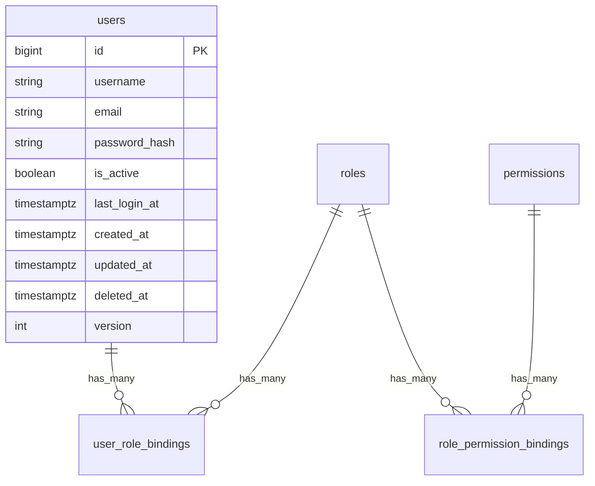

# 用户管理数据库设计

## 1. 设计目标

数据库设计目标：

- 复用 `users` 表承载账号主数据
- 支持用户 CRUD、启用禁用、软删除和密码重置
- 保留历史会话和其他业务数据的用户归属
- 用户角色统一由 RBAC 表维护
- 删除旧的 `users.role` 单字段权限模型

RBAC 表结构、seed 和迁移细节见 `docs/design/rbac/database-design.md`。

## 2. ER 图

当前用户管理依赖的核心关系：

## 3. `users` 表

表示 Hify 内部账号。

字段说明：

| 字段 | 类型 | 说明 |
|---|---|---|
| `id` | `bigint` | 主键 |
| `username` | `varchar(64)` | 登录名和列表展示名 |
| `email` | `varchar(255)` | 邮箱，可用于登录 |
| `password_hash` | `varchar(255)` | 密码哈希，禁止接口返回 |
| `is_active` | `boolean` | 是否启用 |
| `last_login_at` | `timestamptz` | 最近一次登录时间，允许为空 |
| `created_at` | `timestamptz` | 创建时间 |
| `updated_at` | `timestamptz` | 更新时间 |
| `deleted_at` | `timestamptz` | 软删除时间 |
| `version` | `int` | 乐观锁版本字段 |

`users.role` 已被 RBAC 迁移删除，不再作为权限依据，也不再作为兼容字段保留。

## 4. 生命周期规则

### 4.1 启用状态

- `is_active = true`：用户可登录，可访问授权通过的接口
- `is_active = false`：用户被禁用，不允许登录；认证依赖拒绝其访问

禁用不是删除，禁用用户仍然保留在列表中，默认可通过状态筛选查看。

### 4.2 删除状态

- `deleted_at is null`：有效用户
- `deleted_at is not null`：已软删除用户

软删除用户默认不出现在管理列表中，不允许登录，不参与用户名和邮箱唯一性校验。

### 4.3 关键业务规则

- 创建用户时必须写入 `password_hash`，不能存明文密码。
- 创建用户后默认绑定内置 `member` 角色。
- 禁用用户不清空密码，重新启用后仍可用原密码登录，除非管理员重置。
- 软删除用户不清空 `password_hash`，但认证查询必须只查未删除用户。
- 禁止禁用或删除当前登录用户自身。
- 禁止禁用或删除最后一个启用且拥有 `rbac.manage` 权限的用户。

## 5. 约束与索引

### 5.1 唯一约束

为支持软删除后复用用户名或邮箱，唯一性约束只作用于未删除记录：

- `ux_users_username_active`：`username` unique where `deleted_at is null`
- `ux_users_email_active`：`email` unique where `deleted_at is null`

### 5.2 普通索引

建议索引：

- `ix_users_email`：按邮箱查询
- `ix_users_deleted_at`：软删除过滤
- `ix_users_is_active`：状态筛选
- `ix_users_last_login_at`：按最近登录排序
- `user_role_bindings.user_id`：构造用户角色摘要
- `user_role_bindings.role_id`：按角色筛选用户

### 5.3 检查约束

建议检查约束：

- `username <> ''`
- `email <> ''`
- `password_hash <> ''`
- `version >= 1`

角色合法性由 `roles` / `user_role_bindings` 的外键、状态和 RBAC 服务校验保证。

## 6. 外键与历史归属

用户管理删除动作不级联删除业务数据。

历史归属规则：

- 会话、Agent、知识库、工具等业务记录保留原始 `user_id`
- 用户软删除后，历史记录仍显示“已删除用户”或保留脱敏用户名
- 后续如为业务表补外键，建议使用 `ON DELETE RESTRICT` 或默认无级联

## 7. 迁移策略

用户管理基础迁移负责账号字段和软删除唯一索引；RBAC 迁移负责角色权限表、旧角色回填和 `users.role` 删除。

RBAC 落地时的关键步骤：

1. 创建 `roles`、`permissions`、`user_role_bindings`、`role_permission_bindings`。
2. Seed 内置 `admin`、`member` 角色和系统权限点。
3. 将历史 `users.role = 'admin'` 的用户绑定到 `admin`。
4. 将其他有效用户绑定到 `member`。
5. 绑定内置角色默认权限。
6. 删除 `users.role` 字段及其索引、检查约束。

## 8. Seed 与回填要求

上线前必须确认至少存在一个：

- `users.deleted_at is null`
- `users.is_active = true`
- 通过启用角色拥有 `rbac.manage` 权限

的用户，避免系统权限自锁。
